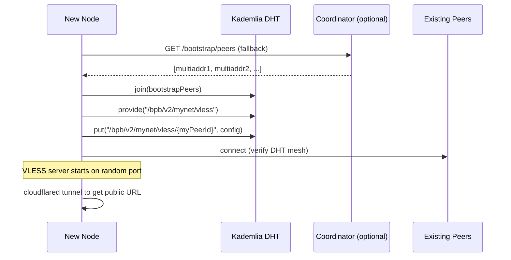
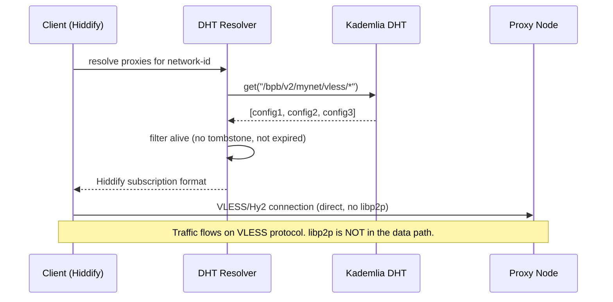
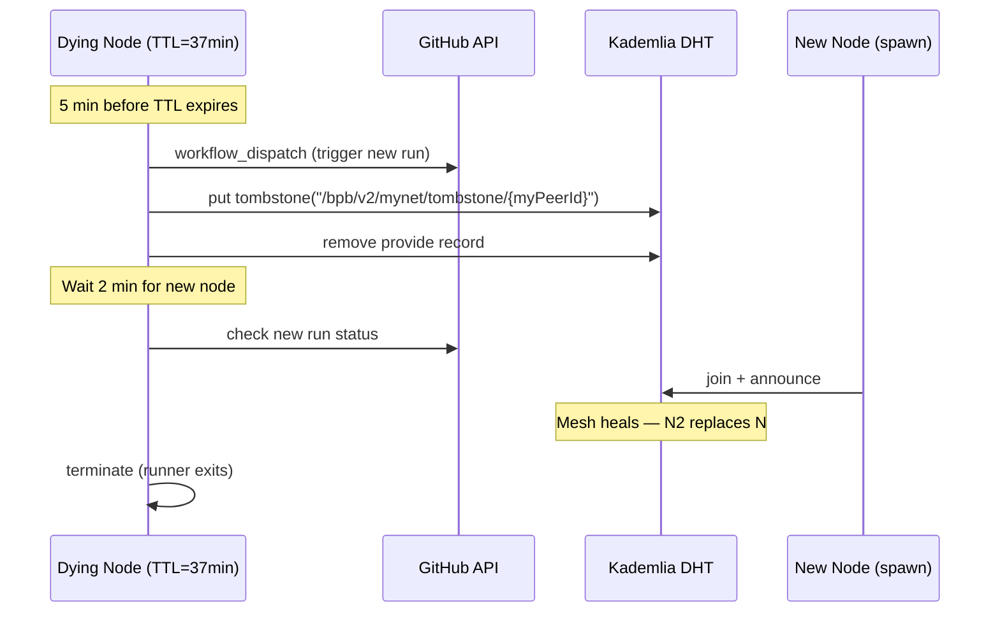

# 🌀 BPB Mesh v2 — Architectural Specification

**Status:** DRAFT v0.4 — Full Consillium Synthesis (6 AIs)  
**Date:** 2026-06-19  
**Authors:** Consillium (ChatGPT, Claude Sonnet 4.5, Gemini Pro, DeepSeek, Kimi 2.6, GLM 5.1)  
**Nature:** Pure science experiment. No production use intended.

> **V3 note:** This document is retained as historical architecture context.
> For implementation, use `docs/SPEC-V3-ANIMAMESH-BACKEND.md`. The V3 spec
> corrects the DHT discovery model, removes protocol secrets from public DHT/IPFS
> records, and treats the Cloudflare Worker as a compatibility subscription
> bridge rather than a DHT client.

---

## 1. What We Have (v1)

BPB-Action-Panel runs VLESS/Hysteria2 proxy servers inside GitHub Actions runners, with a Cloudflare Worker coordinator that aggregates proxy configs and serves Hiddify-compatible subscription URLs.

**v1 topology — centralized, single points of failure:**

```
Client ──► CF Worker (coordinator) ──► /sub/all ──► Client connects to GHA runner
                │
                │ POST /register
                ▼
         GHA Runner (1 at a time, 45min TTL)
                │
                │ cloudflared tunnel
                ▼
         trycloudflare.com free URL
```

**v1 problems:**
- Coordinator = single point of failure + surveillance target
- Only 1 active runner at a time
- Manual or push-triggered respawn
- CF Worker KV as sole discovery mechanism
- If coordinator dies → clients lose all connectivity

---

## 2. What We Want (v2)

A decentralized mesh of ephemeral proxy nodes that find each other via DHT and self-heal when nodes die.

**v2 topology — DHT discovery, direct VLESS transport:**

```
┌─────────────────────────────────────────────────────┐
│                  DHT (Kademlia)                       │
│                                                       │
│  Key: /bpb/v2/{network-id}/vless/{peer-id}           │
│  Val: { host, port, uuid, sni, expiresAt }          │
│                                                       │
│  Node A ◄──announce──► Node B ◄──announce──► Node C  │
│  TTL: 37min              TTL: 52min              TTL: 23min  │
└───────┬─────────────────────┬───────────────────────┬┘
        │                     │                       │
        ▼                     ▼                       ▼
   ┌─────────┐          ┌─────────┐           ┌─────────┐
   │ VLESS   │          │ VLESS   │           │ Hy2     │
   │ server  │          │ server  │           │ server  │
   │ :43124  │          │ :57891  │           │ :38210  │
   │ CF tun  │          │ CF tun  │           │ CF tun  │
   └────┬────┘          └────┬────┘           └────┬────┘
        │                    │                     │
        ▼                    ▼                     ▼
   client connects     client connects      client connects
   DIRECTLY via        DIRECTLY via         DIRECTLY via
   VLESS protocol      VLESS protocol       Hy2 protocol
```

**THE KEY INSIGHT: libp2p is ONLY for discovery. Traffic stays on VLESS/Hysteria2.**

Think BitTorrent Sync (now Resilio Sync): you use DHT/bootstrap servers to find peers, but the actual file sync goes directly between peers. Same principle — DHT finds the nodes, VLESS carries the traffic.

---

## 3. Core Components

### 3.1 DHT Discovery Layer (libp2p/Kademlia)

**Role:** Peer discovery and proxy config distribution. This is the "tracker" in BitTorrent — helps nodes find each other, but is NOT in the data path.

**Protocol:**

```
1. Node boots → joins DHT with known bootstrap peers (or coordinator fallback)
2. Node announces: DHT.provide(key = "/bpb/v2/{network-id}/{protocol}")
3. Node publishes config: DHT.put(key = "/bpb/v2/{network-id}/vless/{peer-id}", value = JSON)
4. Client resolves: DHT.get("/bpb/v2/{network-id}/vless/*") → list of proxy configs
5. Client connects to chosen node via VLESS/Hy2 directly (NOT through libp2p)
```

**DHT record format:**

```json
{
  "peerId": "12D3KooW...",
  "protocol": "vless",
  "host": "abc-xyz.trycloudflare.com",
  "port": 443,
  "uuid": "f47ac10b-58cc-4372-a567-0e02b2c3d479",
  "sni": "abc-xyz.trycloudflare.com",
  "security": "tls",
  "network": "bpb-mesh-42",
  "ttl": 2340,
  "bornAt": "2026-06-19T20:00:00Z",
  "expiresAt": "2026-06-19T20:39:00Z",
  "signature": "<Ed25519 sig of above fields>"
}
```

**DHT key namespace:**

```
/bpb/v2/{network-id}/                        ← prefix scan = all configs
/bpb/v2/{network-id}/vless/{peer-id}         ← specific VLESS node
/bpb/v2/{network-id}/hysteria2/{peer-id}     ← specific Hy2 node
/bpb/v2/{network-id}/tombstone/{peer-id}     ← dead node announcement
```

**Bootstrap strategy (priority order):**

1. Known peer addresses from previous session (persisted in repo)
2. Coordinator tracker endpoint: `GET /bootstrap/peers` → list of multiaddrs
3. Hardcoded relay/seed nodes (like BitTorrent DHT bootstrap nodes)
4. LAN mDNS (if nodes happen to be on same network — unlikely but free)

### 3.2 VLESS/Hysteria2 Transport Layer

**Role:** Carry actual proxy traffic. Completely unchanged from v1 — sing-box for VLESS, Hysteria2 binary for Hy2.

**No libp2p in the data path. Ever.**

The VLESS/Hy2 server runs on the GHA runner exactly as v1. The only change is: instead of only registering with a CF Worker coordinator, the node ALSO announces itself on the DHT. Clients who discover the node via DHT connect to it via VLESS/Hy2 directly.

### 3.3 Ephemeral Lifecycle Manager

**Role:** Manage node birth, TTL, death, and respawn.

```
Lifecycle:
  1. SPAWN      — GHA runner starts
  2. BOOTSTRAP  — join DHT, find peers
  3. ANNOUNCE   — publish proxy config to DHT
  4. SERVE      — proxy traffic flows, VLESS/Hy2 running
  5. PRE_DEATH  — TTL approaching, trigger respawn
  6. DEREGISTER — publish tombstone to DHT, deregister
  7. DIE        — runner terminates
  8. RESPAWN    — git push / workflow_dispatch → new runner starts at step 1
```

**TTL allocation:**

- Each node draws a random TTL from `uniform(15, 60)` minutes on spawn
- The jitter prevents synchronized herd death — at any moment, some nodes are young, some are old
- 5 minutes before TTL expires, node enters PRE_DEATH phase:
  1. Triggers respawn (git push / workflow_dispatch)
  2. Waits up to 2 minutes for new node to bootstrap
  3. Publishes tombstone + deregisters
  4. Terminates

**Respawn mechanism (redundancy — try in order):**

| Method | Trigger | Reliability |
|---|---|---|
| `workflow_dispatch` API | Node calls GitHub API directly | High (needs token) |
| Git push (empty commit) | Node pushes to repo, push event triggers new run | Medium (race with repo) |
| Scheduled cron | `schedule: - cron: '*/15 * * * *'` as backup | Low (delay up to 15min) |
| Peer-triggered | Dying node asks a live peer: "trigger respawn for me" | Medium (needs cooperative peer) |

### 3.4 Coordinator-as-Tracker (Optional)

**Role:** DHT bootstrap helper + legacy client bridge. Like a BitTorrent tracker — useful but not required.

**New endpoints (added to existing CF Worker):**

```
GET /bootstrap/peers          → returns list of known DHT multiaddrs
GET /sub/all                  → existing, but now aggregates from DHT too
GET /sub/dht                  → resolves DHT on-demand, returns fresh proxy list
POST /register                → existing, still works for non-DHT nodes
GET /mesh/status              → mesh health: peer count, avg TTL, churn rate
```

**Degradation behavior:**

| Coordinator Status | DHT Status | Client Access |
|---|---|---|
| Online | Active | Both paths — coordinator caches DHT results |
| Online | No peers | Coordinator serves its own KV (legacy fallback) |
| Offline | Active | Client resolves DHT directly — zero impact |
| Offline | No peers | Dead mesh, needs manual intervention |

### 3.5 Client Resolver

**Role:** Let v2ray/Hiddify clients discover proxy nodes without a coordinator.

**Two modes:**

1. **Native DHT resolver** (standalone CLI/Library):
   - Joins DHT temporarily
   - Resolves `/bpb/v2/{network-id}/*`
   - Generates Hiddify subscription config
   - Exits DHT — client connects via VLESS/Hy2 only

2. **Coordinator-backed** (zero install):
   - Client hits `GET /sub/all` on coordinator as before
   - Coordinator internally resolves from DHT + its own KV
   - Client doesn't know or care — backward compatible

---

## 4. Data Flow Diagrams

### 4.1 Node Bootstrap (discovery only)



### 4.2 Client discovers proxy (no coordinator)



### 4.3 Node death and respawn



---

## 5. Concurrency Model

**Multiple nodes can run simultaneously.** Unlike v1 (one runner at a time), v2 needs N parallel runners:

```
Desired state: 2-5 active nodes at any time

Strategy:
  - On first push: spawn 3 runners (matrix strategy in GHA)
  - Each runner gets random TTL in [15, 60] min
  - When a runner is about to die, it triggers ONE new runner
  - Staggered TTLs ensure at least 1-2 nodes are always alive
  - Maximum concurrent: controlled by GITHUB_TOKEN rate limits
```

**GHA workflow matrix:**

```yaml
strategy:
  matrix:
    node-index: [0, 1, 2]  # 3 initial nodes
  fail-fast: false
```

Each node in the matrix gets a slightly offset TTL base to prevent synchronized death.

---

## 6. Threat Model

| Threat | v1 Status | v2 Mitigation |
|---|---|---|
| Coordinator DDoS | Fatal | DHT resolves locally, coordinator optional |
| Coordinator compromised | MITM risk | DHT records signed with Ed25519, clients verify |
| Sybil attack (fake nodes) | N/A (centralized) | Network-ID = shared secret, peer verification |
| Single runner dies | Total outage | Multiple concurrent nodes, DHT failover |
| Traffic correlation | Partial (CF tunnel) | Same + DHT means no single coordinator to monitor |
| Node impersonation | N/A | DHT provider records bound to PeerId |
| Ghost nodes (registered but dead) | Common (KV TTL 24h) | DHT short re-announce (5min), tombstones, client verification |

---

## 7. Technology Stack

| Component | Technology | Reason |
|---|---|---|
| DHT | `@libp2p/kad-dht` (Node.js) | Standard Kademlia, npm package, runs in GHA node |
| Peer identity | `@libp2p/peer-id` (Ed25519) | Cryptographic identity, DHT provider record signing |
| Transport (discovery) | `@libp2p/tcp` or `@libp2p/websockets` | DHT communication between nodes |
| NAT traversal | Multi-provider tunnel layer (see §8.6) | Abstraction over CF/bore/localhost.run/etc with auto-fallback |
| Proxy traffic | sing-box (VLESS) + Hysteria2 | Unchanged from v1 — proven, efficient |
| Coordinator | Cloudflare Worker | Unchanged — now with optional DHT bridge |
| Respawn trigger | GitHub REST API | `POST /repos/{owner}/{repo}/actions/workflows/{id}/dispatches` |

**Runtime in GHA runner:**

```
┌─────────────────────────────────────────┐
│           GHA Runner (ubuntu-latest)     │
│                                          │
│  ┌──────────┐  ┌──────────┐            │
│  │ libp2p   │  │ sing-box │            │
│  │ DHT node │  │ (VLESS)  │            │
│  │ :4001    │  │ :43124   │            │
│  └────┬─────┘  └────┬─────┘            │
│       │              │                   │
│       │   ┌──────────┘                   │
│       │   │                              │
│       ▼   ▼                              │
│  ┌──────────────┐                       │
│  │ cloudflared  │ ──► trycloudflare.com │
│  │ tunnel       │     (public URL)      │
│  └──────────────┘                       │
│                                          │
│  ┌──────────────┐                       │
│  │ lifecycle.js │  TTL, respawn, death   │
│  └──────────────┘                       │
└─────────────────────────────────────────┘
```

---

## 8. Consillium Decisions (Post-Review)

The three AIs (ChatGPT, Sonnet 4.5, Gemini Pro) reviewed the spec and voted on 6 open questions. Below are the resolved decisions, dissenting views, and novel alternatives surfaced during review.

### Voting Matrix (7-AI Consillium)

| Q | ChatGPT | Sonnet 4.5 | Gemini Pro | DeepSeek | Kimi 2.6 | **Command-A** | GLM 5.1 | Decision |
|---|---|---|---|---|---|---|---|---|
| Q1 Bootstrap | A+C (coord+bootstrap) | E+B (gossipsub+git) | D (DNS TXT) | D+DNS (户籍+fallback) | B+E (gossipsub+git) | **B+E+Gist** (git-artifact stigmergy) | D (DNS) +墓碑 (tombstone tracking) | **Layered cascade** |
| Q2 Client DHT | B (HTTP gateway) | B (HTTP gateway) | C (IPNS) | B+特色 (any node=gateway) | B+role (gateway as role) | B+gateway-as-role (baozi stall) | B + 驿站 (relay-node as resolver) | **B — HTTP-to-DHT gateway** |
| Q3 Multi-hop | B (design now) | B (design now) | A (skip) | B+留白 (empty-space design) | Gemini's parallel (swarm skin) | **parallel only** (reframe as resilience) | **Kill it** — remove `route:[]` | **C — Kill serial multi-hop entirely** |
| Q4 Respawn | C (overspawn) | C (overspawn) | A (accept gap) | C+禅让 (abdication handoff) | C+swarming (litters not clones) | — | 父死子继逾期篡位 (successor record) | **C — proactive overspawn** |
| Q5 Network ID | C (invitation codes) | A+C (secrets+invites) | A (repo secrets) | A+C+差序格局 (concentric trust) | C+capability (delegable capabilities) | — | 门派制 (clan lineage, hash-tree namespaces) | **A+C — secrets + invites** |
| Q6 Tunnel | B (multi-provider) | B+E (multi+relay) | B (multi-provider) | B+农村包围城市 (rural strategy) | E as destiny (relay as true form) | — | B+暗网潜行 (emergency-only libp2p bypass) | **B+E — multi-provider + relay hatch** |
| Q7 Defection | — | — | — | B — 仓颉审计 (meritocratic audit) | — | — | **锦+推恩** (randomized probes +举报) | **Reputation + PoW stake +举报 incentives** |

---

### Q1: DHT Bootstrap — RESOLVED: Layered Cascade

**Consillium verdict:** All three AIs proposed different primary mechanisms. The synthesis is a **layered cascade** — try each source in priority order, use whatever works:

```
New node boots:
  1. DNS TXT record lookup (Gemini's pick — most resilient, cached globally)
  2. Coordinator /bootstrap/peers endpoint (ChatGPT's pick — HTTP fallback)
  3. GossipSub topic subscription for 10-15 seconds (Sonnet's pick — passive discovery)
  4. Git-persisted .github/bpb-peers.json from last session (Sonnet's fallback)
  5. Public libp2p bootstrap nodes (ChatGPT's secondary — bootstrap.libp2p.io)
  6. Hardcoded seed peers (if all else fails)
```

**Key principle from ChatGPT:** "Do not optimize for 'no coordinator'. Optimize for 'coordinator compromise is survivable.'" BitTorrent still has trackers. IPFS still has gateways. The coordinator is one bootstrap source, not the authority.

**Gemini's insight:** DNS is the most resilient, highly-cached, globally distributed read-only database in existence. Bitcoin, Tor, and IPFS all use DNS as their ultimate fallback. A DNS TXT record removes the need for an active HTTP coordinator while solving the "initial peer" problem elegantly.

**Novel alternatives surfaced:**
- **Signed rendezvous records** (ChatGPT) — DNSSEC-like bootstrap manifests with rotating seed URLs
- **GitHub Gist as tracker** (Gemini) — runners push multiaddrs to a secret Gist via API. Same ecosystem, zero external infra, native versioning
- **Hybrid DNS + IPNS** (Sonnet) — Coordinator publishes signed IPNS record pointing to peer list, resolvable via any public IPFS gateway
- **GHA artifact stigmergy** (Command-A/Kimi) — Nodes write encrypted peer lists to GHA's own artifact storage (7-day TTL, accessible across runs). No git commits, no external DNS, no coordinator. The CI system becomes the memory. Like ants leaving chemical trails — the substrate IS the communication channel

---

### Q2: Client-Side DHT — RESOLVED: HTTP-to-DHT Gateway

**Consillium verdict:** 2-1 majority for **B (HTTP-to-DHT gateway)**. Gemini dissented for IPNS.

**Rationale:** A thin Go/Rust binary (or CF Worker) that embeds libp2p and exposes `GET /resolve/{network-id}` → Hiddify subscription JSON. Client apps stay unchanged — they just point to a URL. This is the BitTorrent Sync model: thin native helper + dumb client.

**Why IPNS (Gemini's pick) lost:** IPNS has 30s+ resolve latency — too slow for UX. IPFS gateway reliability varies. But IPNS is retained as a **secondary resolver** in the cascade — the gateway can fall back to IPNS if DHT resolution fails.

**Novel alternatives surfaced:**
- **DHT-over-HTTP relay protocol** (Sonnet) — Standardize JSON-RPC `{method: "DHT.get", key: "..."}` where ANY mesh node acts as DHT proxy. Clients become truly thin (just HTTP), every node is a potential gateway. No separate service needed.
- **Subscription URLs with embedded resolver fallback** (ChatGPT) — `bpb://mesh/{resolver1}/{resolver2}/{resolver3}` — client auto-tries discovery providers like multi-DNS
- **Nostr relays** (Gemini) — Nodes broadcast VLESS configs as ephemeral Nostr events (Kind 20000+). Clients connect to any public Nostr relay via lightweight WebSockets

**Implementation:** Primary resolver = HTTP-to-DHT gateway. Secondary = any mesh node as DHT proxy (Sonnet's idea). Tertiary = IPNS via gateways.

---

### Q3: Multi-Hop Relay — RESOLVED: Design Now, Implement Later

**Consillium verdict:** 2-1 majority for **B (design now, defer implementation)**. Gemini dissented for A (skip it entirely).

**Gemini's argument for skipping:** Multi-hop across ephemeral nodes creates exponential failure rates. If Node A lives 15 min, Node B 30 min, Node C 45 min, the MTBF of a 3-hop circuit is reduced to mere minutes. CF tunnel already acts as an entry guard.

**Counter-argument (ChatGPT + Sonnet):** Design cost is near-zero (add `relay_capable: bool` to DHT records, extend config schema with `route: []`). Implementation cost is high — defer the latter. The protocol should reserve space without breaking later.

**Concession to Gemini:** Single-hop is the default. Multi-hop is opt-in and WARNED as unreliable in the UI/docs.

**Novel alternatives surfaced:**
- **Probabilistic relay** (ChatGPT) — 90% direct, 10% multi-hop. Privacy testing without destroying performance
- **Entry-node-chosen paths** (Sonnet) — Client says "2-hop" in config; entry node picks random relays from DHT and builds the circuit automatically. Simpler client, better against targeted attacks
- **Client-side multiplexing** (Gemini) — Instead of serial chaining, configure client to open 3 parallel single-hop VLESS tunnels simultaneously. When one node dies, packets seamlessly flow over the other two. No multi-hop needed — just redundancy

**Implementation:** DHT record schema includes `relay_capable: bool` and `route: []` (empty for now). Gemini's multiplexing idea is adopted as the P6 deliverable instead of serial multi-hop.

**⚠️ Q3 REVISION — GLM 5.1 challenge (Kill it entirely):** GLM argues that reserving `route: []` in the schema is **code debt violating YAGNI** — if serial multi-hop is architecturally wrong for ephemeral environments, don't even leave the seam. Combined with Gemini's MTBF argument and Kimi's reframing as "swarm skin" (parallel resilience, not serial privacy), the consillium now leans toward **removing `route: []` entirely**. The DHT schema includes only `relay_capable: bool` for future transport-level decisions. Serial multi-hop is removed from the spec. Period.

**Kimi 2.6's reframe:** Multi-hop as privacy is YAGNI. Multi-hop as *resilience topology* is genius. Don't do A→B→C. Do client opens 3 independent single-hops, load-balances across them, recovers transparently when one dies. This isn't "future-proofing" a feature; it's discovering that P6 already solves a problem you framed wrong.

**GLM 5.1's "双轨制" (Dual Track):** Client simultaneously opens 3 single-hop links. One is "主轨" (primary, high-frequency). Two are "暗轨" (dark tracks — heartbeat only, zero-latency switchover when primary dies). Like high-speed rail's redundant power grid.

---

### Q4: Respawn Race Condition — RESOLVED: Proactive Overspawn

**Consillium verdict:** 2-1 majority for **C (proactive overspawn)**. Gemini dissented for A (accept the gap).

**Gemini's argument:** Complex state handoffs between dying/spawning nodes on CI infrastructure will invariably fail due to opaque queuing delays and API rate limits. Distributed systems thrive on independent agents with eventual consistency. Staggered TTLs + client failover make the gap irrelevant.

**Counter-argument (ChatGPT + Sonnet):** The desired state is already 2-5 nodes. Overspawn is Kubernetes thinking — maintain N+1 until a dying node is confirmed replaced, then let the old one die. Cost: ~30 extra runner-minutes per day (negligible on free tier).

**Synthesis:** Adopt C with Gemini's safeguard — proactive overspawn is the primary strategy, but the system is designed to tolerate gaps gracefully (Gemini's point). If overspawn fails due to API rate limits, the mesh degrades to "accept the gap" mode. No single point of coordination in the respawn.

**Novel alternatives surfaced:**
- **Lease-based ownership** (ChatGPT) — Each node holds a mesh capacity lease that expires in 10 min. Nodes dying early renew responsibility
- **DHT-based leader election** (Sonnet) — Nodes elect a "shepherd" (leader) responsible for monitoring peer count. Shepherd rotates every 10 min via DHT consensus
- **Decoupled cron spawner** (Gemini) — A cron fires every 15 min evaluating DHT health; spawns nodes only if total active TTL sum drops below threshold. Decouples birth from death

---

### Q5: Network Identity — RESOLVED: Repo Secrets + Optional Invitation Codes

**Consillium verdict:** A+C — repo secrets as default, invitation codes as optional sharing mechanism.

**ChatGPT** pushed for C (invitation codes) as the primary. **Sonnet** proposed A+C (secrets by default, invites for "join my mesh"). **Gemini** argued for A alone (segregated darknets distribute abuse vectors).

**Gemini's key argument:** A global public mesh will immediately attract abuse, turning the project into a massive target for GitHub's Trust & Safety bans. Repo secrets create segmented, private darknets. Only people with the secret can compute the DHT keyspace.

**Synthesis:** Default = repo secrets (Gemini/Sonnet). Invitation codes are an **optional upgrade** for sharing (ChatGPT/Sonnet). Coordinator issues time-limited, single-use invite tokens. New repo sets `NETWORK_ID=inv_abc123` → coordinator resolves → returns actual network-id + signs node into DHT.

**Network-id format (ChatGPT's suggestion, adopted):**
```
mesh-id + membership-signature + protocol-version

Example: bpb-mesh-v2:{network-id}:{signed-membership}
```

**Novel alternatives surfaced:**
- **Capability tokens** (ChatGPT) — Instead of "joining", you possess capability X therefore you can announce. Like Macaroons/bearer capabilities
- **Hierarchical network-ids** (Sonnet) — `{org}/{team}/{mesh}` format for multi-tenant meshes with ACLs
- **Cryptographic Swarm Keys (PSK)** (Gemini) — Generate libp2p PSK from user seed phrase, decoupled from GitHub. Enables meshes mixing GHA + GitLab + Bitbucket runners

---

### Q6: Tunnel SPOF — RESOLVED: Multi-Provider + Relay Escape Hatch

**Consillium verdict:** Unanimous agreement on **B (multi-provider)**. Sonnet adds **E (libp2p relay as last-resort escape hatch)**.

**Tunnel provider priority cascade:**
```
Node boots, tries tunnels in order:
  1. trycloudflare (fast, free, rate-limited)
  2. bore.pub (OSS alternative)
  3. localhost.run or pinggy
  4. ngrok (if API key available)
  5. Self-hosted VPS relay (if configured)
  6. libp2p circuit relay (last resort — slower, but works)
```

Node announces with `transport: "tunnel"` for providers 1-4, or `transport: "libp2p-relay"` for 6. Clients who don't support relay skip that node. Mesh stays alive even during CF outages.

**Novel alternatives surfaced:**
- **Tunnel marketplace** (ChatGPT) — Nodes advertise relay capacity + latency + bandwidth. Like a relay economy
- **Cloudflare named tunnel as sidecar** (Sonnet) — Run `cloudflared` with a named tunnel (requires CF account, still free tier). More reliable than trycloudflare, deterministic URLs, pre-configure DNS. Falls back to trycloudflare if no CF account
- **Tor Onion Services** (Gemini) — GHA runner exposes VLESS via Tor Hidden Service (.onion). Natively solves NAT traversal, no corporate tunnel dependency, absolute anonymity. Latency increases but resilience is absolute. Client routes VLESS traffic through Tor to hit the endpoint

**Implementation:** Abstract tunnel behind a `TunnelProvider` interface (ChatGPT's suggestion): `start() / stop() / endpoint() / health()`. Implement providers as pluggable modules.

---

### Q7: Node Defection & Sybil Resistance — RESOLVED: Meritocratic Web of Trust + PoW Stake

**Consillium verdict:** DeepSeek identified a gap missed by all three other AIs: **what stops a node from going rogue?** Announcing fake configs (phishing), logging traffic (surveillance), or running a Sybil flood. The answer is a **法家 (Legalist) system** — make defection unprofitable, not impossible.

**DeepSeek's layered defense — 仓颉审计 (Cangjie Audit):**

1. **信任累积 (Trust Accumulation, 考课):** Every node starts at zero trust. Track uptime, bytes served, config consistency. Require 72+ hours of continuous presence before granting proxy-routing rights. A Sybil army evaporates under the burn of time cost.

2. **连坐制 (Collective Accountability):** When Node A vouches for Node B (by routing traffic through it), A's reputation is partially on the line. If B is caught logging, both take a hit. Every node becomes an auditor because every node has something to lose.

3. **鲲鹏验证 (Periodic Probe Traffic):** The coordinator or senior nodes send synthetic requests through random nodes carrying known-plaintext canaries. If the canary appears in unexpected places, the node is flagged as compromised.

**Why Sybil fails:** An attacker must: (a) run 500 nodes for 72+ hours → massive compute cost; (b) maintain consistent configs → operational complexity; (c) survive probe traffic; (d) accumulate reputation from scratch → time cost that can't be bought.

**DeepSeek's novel alternative — 投名状 (Blood Oath Model):**
- **PoW stake at join time:** Solve a 30-min Argon2id commitment puzzle to generate a non-transferable reputation token
- **Sponsor vouching:** A new node must be sponsored by an existing node, who stakes their own reputation. If the new node defects, the sponsor loses their stake too — 梁山泊规矩 (Water Margin rules)
- **Canary honeypot:** Run a honeypot proxy alongside the real one — if a node logs traffic, it logs incriminating evidence against itself

**Chinese philosophy framing:** 制度大于人心 — systems over sentiment. Han Feizi: don't ask if someone is virtuous; ask if their record complies (考课). Make punishment certain, not severe — 商鞅变法 (Shang Yang's reforms).

**Implementation:** Add `/bpb/v2/{network-id}/reputation/{peer-id}` DHT key. Reputation = f(uptime, bytes, consistency, sponsor-score, probe-pass-rate). Client filters: minimum reputation threshold before using a node.

---

### Cross-Cutting Insights from Consillium

1. **Health scoring** (ChatGPT) — DHT should return node rankings, not flat lists. Include `latency`, `uptime`, `ttl_remaining`, `failures`. Client picks best. Adopted: add `/bpb/v2/{network-id}/metrics/{peer-id}` DHT key.

2. **Control plane / data plane separation is sacred** — All four AIs agreed this is the strongest part of the design. Never compromise it.

3. **Client-side multiplexing** (Gemini) — Client opens 3 parallel single-hop tunnels simultaneously. When one dies, traffic flows over the other two. This replaces serial multi-hop (P6) with a more robust parallel redundancy model.

4. **Metrics & observability** (Sonnet) — Each node publishes uptime, bandwidth, peer count to DHT. Coordinator exposes live mesh dashboard. Zero cost, high value for debugging.

5. **"Do not optimize for no coordinator"** (ChatGPT) — The most pragmatic principle of the review. Optimize for *coordinator compromise is survivable*. BitTorrent still has trackers. IPFS still has gateways.

6. **Gemini's framing of the environment** — "Ephemeral infrastructure as highly hostile territory. This is a continuous rolling blackout." This should inform every resilience decision.

7. **DeepSeek's 阴阳平衡 (Yin-Yang Balance)** — The spec lives on a yin-yang knife-edge. Too much yang (centralized order) → coordinator SPOF / dictatorship. Too much yin (decentralized chaos) → Sybil swamp. v2's genius is choosing yin-yang per-layer: bootstrap = yang-leaning, DHT = yin-leaning, authorization = balanced (差序格局), defection defense = yang inside yin (centralized reputation, P2P enforcement). This is 太极 in architecture.

8. **DeepSeek's Q7: Node Defection** — The question the other three AIs missed. Trust must be earned, not given. Reputation scoring + PoW stake + sponsor vouching makes Sybil attacks economically irrational. 制度大于人心.

9. **Kimi 2.6's deep structure** — Controlled flux with recursive locality. Things that look global are local at each layer. The real v2 victory is **immortal liquidity through constant death** — the client's experience of the mesh feels like a single node that never dies, even though every 15 minutes it's entirely different atoms.

10. **GLM 5.1's three critical implementation warnings** (the most important technical input of the entire consillium):
    - **GHA concurrency ceiling:** GitHub's free Runner limits concurrent Jobs per Repo to 2-3, with remaining jobs queuing for **tens of minutes**. TTL staggering does NOT solve this — queue delays can exceed node lifetimes. **Mitigation: multi-repo strategy.** Use a pool of 5+ fork repositories. Trigger runners by pushing to a random fork, not the main repo, to bypass per-repo concurrency limits.
    - **DHT route table rot (腐县问题):** Kademlia KBuckets fill with dead nodes in high-churn environments. Must set **extremely short KBucket refresh cycles (2 minutes)** or DHT query failure rates increase exponentially.
    - **Client retry logic is 70% of success:** v2's viability is 30% server architecture, 70% client fault-tolerance. Clients must implement "无情降级" (ruthless degradation): 1 failure → probe, 3 failures → mark dead + auto-resubscribe. A dumb client that retries a dead node will make the mesh feel broken regardless of architecture.

11. **GLM 5.1's Q7 refinements** — Two "toxic" improvements to DeepSeek's Cangjie Audit:
    - **锦衣卫 (Imperial Guard) — unpredictable probes:** If canary probes are periodic, malicious nodes learn to behave during test windows (like 工程豆腐渣). Must use random-burst, high-concurrency decoy traffic with **dynamically-downloaded canary特征库**.
    - **推恩令 (Enfeoffment Decree) — defect-o-your-neighbor incentives:** If Node A provides cryptographic evidence of Node B's malice (wrong routing, payload tampering), A **acquires a portion of B's staked reputation**. This makes Sybil armies self-cannibalize — the profit from betraying a co-conspirator exceeds the profit from cooperating in an attack.

12. **GLM 5.1's 墓碑追踪 (Tombstone Tracking) for Q1** — New nodes shouldn't search for live peers; they should read tombstones. Dead nodes just left wills (tombstone + respawn trigger). The new node reads the will, follows the trail to find the successor that was just triggered but hasn't fully registered yet. This is "inquiring at the graveyard,- not "searching for the living."

13. **GLM 5.1's 驿站模型 (Relay Station Model) for Q2** — Every VLESS node exposes a lightweight `/resolve` API on its existing HTTP port. Client subscription URLs point to random mesh nodes, not the coordinator. One node dies? Client retries another. This **eliminates coordinator SPOF in subscription discovery entirely** — the coordinator becomes purely optional even for client bootstrap.

---

## 9. Implementation Roadmap (Post-Consillium)

| Phase | Deliverable | Effort | Risk | Consillium Input |
|---|---|---|---|---|
| **P0** | Node runs libp2p DHT, announces proxy config | 2-3 days | Low | |
| **P1** | TTL-based lifecycle with git-push respawn | 1-2 days | Low | |
| **P2** | Coordinator gains DHT bridge (/bootstrap/peers, /sub/dht) | 1 day | Low | ChatGPT: coordinator as one bootstrap source, not authority |
| **P3** | HTTP-to-DHT gateway (thin binary or CF Worker) | 2-3 days | Medium | Sonnet: DHT-over-HTTP protocol so any node is a gateway |
| **P4** | Multi-node matrix + proactive overspawn | 1-2 days | Low | Consillium: maintain N+1 nodes at all times |
| **P5** | Tombstone + mesh self-healing + metrics DHT key | 1-2 days | Medium | ChatGPT: health scoring in DHT records |
| **P6** | Parallel multiplexed tunnels (NOT serial multi-hop) | 3-5 days | High | Gemini: client-side multiplexing replaces serial chaining |
| **P7** | Tunnel provider abstraction layer | 1-2 days | Low | Consillium: TunnelProvider interface, cascade fallback |
| **P8** | DNS TXT + Gist + GossipSub bootstrap cascade | 2-3 days | Medium | All 4 AIs contributed layers |
| **P9** | Reputation system + PoW stake + probe canaries + 举报 incentives | 3-5 days | High | DeepSeek: 仓颉审计 + 投名状 model. GLM: 锦衣卫 random probes + 推恩令 defect incentives |

---

## 10. Constraints & Principles

1. **Pure science.** This is a research experiment in decentralized ephemeral proxy meshes. No production. No users. No liability.
2. **libp2p for discovery ONLY.** Data path = VLESS/Hy2 directly. Never route traffic through libp2p. This is non-negotiable. (Unanimous consillium agreement.)
3. **Coordinator is optional.** The mesh must work without it. It's a BitTorrent tracker, not a server. (ChatGPT: "Optimize for coordinator compromise is survivable, not for no coordinator.")
4. **Ephemeral by design.** Nodes live minutes, not days. No persistent state. Identity is per-lifecycle. (Gemini: "Treat this as highly hostile territory — a continuous rolling blackout.")
5. **Backward compatible.** v1 clients (using /sub/all on coordinator) must keep working.
6. **Minimal dependencies.** Prefer npm packages over custom protocols. Prefer standard libp2p protocols over ad-hoc messaging.
7. **Stagger, don't sync.** Random TTLs, jittered announces, no herd behavior.
8. **Layered resilience.** Every critical function (bootstrap, tunnel, discovery) has a cascade of fallbacks. No single mechanism is trusted alone. (Synthesized from consillium.)
9. **Health over liveness.** DHT records carry health scores. Clients pick best nodes, not just any node. (ChatGPT.)
10. **Parallel beats serial.** Client-side multiplexing > serial multi-hop for resilience. (Gemini.)
11. **Trust is earned, not given.** Every node starts at zero trust. Reputation accumulates through uptime, consistency, and peer vouching. Sybil attacks must burn time and compute — making them economically irrational. (DeepSeek: 制度大于人心.)
12. **阴阳平衡 (Yin-Yang Balance).** Every layer needs both centralized structure and decentralized resilience. Bootstrap = yang-leaning. DHT = yin-leaning. Authorization = balanced. Defection defense = yang inside yin. (DeepSeek.)
13. **Impossible liquidity through constant death.** The client's experience of the mesh should feel like a single immortal node, even though every 15 minutes it's composed of entirely different atoms. (Kimi 2.6.)
14. **Client fault-tolerance is 70% of viability.** Architecture is 30%, client retry logic is 70%. Clients must implement ruthless degradation: 1 failure → probe, 3 failures → mark dead + auto-resubscribe. (GLM 5.1.)
15. **Serial multi-hop is dead. Killed by the consillium.** Remove `route: []` from schema entirely. Parallel multiplexing (3 single-hop = primary + 2 dark tracks) is the resilience model. Serial multi-hop belongs to Tor, not to ephemeral mesh. (GLM 5.1, Gemini, Kimi 2.6.)
16. **Multi-repo strategy required.** GitHub's free Runner limits per-repo concurrency to 2-3. Queue delays can exceed node lifetimes. Use a pool of fork repositories to trigger runners and bypass per-repo limits. (GLM 5.1.)
17. **DHT must refresh aggressively.** In high-churn environments, KBucket refresh cycles must be <2 minutes or query failure rates increase exponentially. (GLM 5.1: 腐县问题.)

---

*End of specification v0.4. Full consillium review complete (7 AIs). Decisions recorded in §8.*
